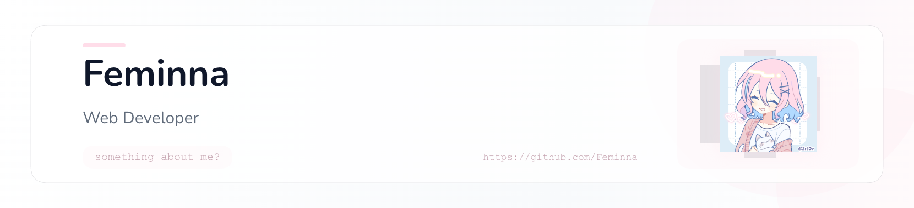

<picture>
   <source media="(prefers-color-scheme: dark)" srcset="art/header-dark.png">
   
</picture>

# Hey there, I'm **Feminna** 👋

 

---

## 🌸 About Me

<table width="100%">
<tr>

<td width="65%" valign="top">

### ✨ From Design to Development

I started with UI/UX design, creating interfaces and user experiences that felt intuitive and meaningful. Over time, curiosity pushed me deeper into development, where I discovered the joy of building the ideas I designed.

Today, I work across design and development, creating full-stack applications, mobile experiences, and AI-powered solutions.

Currently pursuing Computer Science Engineering while exploring product development, AI, and open-source technologies.

</td>

</tr>
</table>

## 🚀 Featured Projects

<table>
<tr>

<td align="center" width="25%">

### 📜 HeritageOCR

Historical document digitization using OCR

<a href="https://github.com/Feminna/HeritageOCR">View Project →</a>

</td>

<td align="center" width="25%">

### 🏢 Blessing Associates

Professional registration services platform

<a href="https://github.com/Feminna/blessing-associates">View Project →</a>

</td>

<td align="center" width="25%">

### 🍳 Recipe App

Smart recipe recommendation application

<a href="https://github.com/Feminna/Recipie-Recommendation-App">View Project →</a>

</td>

<td align="center" width="25%">

### 🎮 AI Games Lab

Interactive games enhanced with AI

<a href="https://github.com/Feminna/simple-games-with-AI-integration-">View Project →</a>

</td>

</tr>
</table>

---

# 💻 Tech Stack

---

  

---

---

<!--
GitHub Action Required:

name: Generate Snake

on:
  schedule:
    - cron: "0 */12 * * *"
  workflow_dispatch:

jobs:
  build:
    runs-on: ubuntu-latest

    steps:
      - uses: Platane/snk@v3
        with:
          github_user_name: [YOUR_USERNAME]
          outputs: |
            dist/github-contribution-grid-snake.svg
            dist/github-contribution-grid-snake-dark.svg?palette=github-dark

      - uses: crazy-max/ghaction-github-pages@v4
        with:
          target_branch: output
          build_dir: dist
        env:
          GITHUB_TOKEN: ${{ secrets.GITHUB_TOKEN }}
-->

<picture>
  <source media="(prefers-color-scheme: dark)" srcset="https://raw.githubusercontent.com/feminna/feminna/output/github-contribution-grid-snake-dark.svg">
  <source media="(prefers-color-scheme: light)" srcset="https://raw.githubusercontent.com/feminna/feminna/output/github-contribution-grid-snake.svg">
  
</picture>

---

# 🌐 Connect With Me

---

### 💖 *Still learning!*

  

<!--
**Feminna/Feminna** is a ✨ _special_ ✨ repository because its `README.md` (this file) appears on your GitHub profile.
